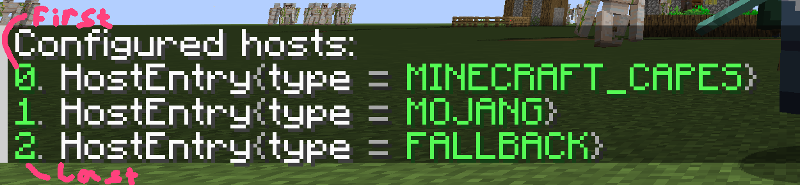

GU# History of OpenMCSkins

Most skin mods allow you to load skins from multiple hosts, but they either don't allow you to change the loading order,
or it is customized by editing the configuration file through a text editor.

[I](https://github.com/zatrit/), as an OpenMCSkins developer, was not happy with this. So I wanted to write my own mod
with the ability to fine-tune it. This is how OpenMCSkins 1.0 was created, but at the time I didn't know Java very well,
which led to [numerous bugs](https://github.com/zatrit/openmcskins/issues) that I couldn't fix. In the spring of 2023, I
decided to rewrite it from scratch, which is how OpenMCSkins 2.0 was created.

OpenMCSkins now has fewer bugs, better performance, and community support
via [Discord](https://discord.gg/P4SX2uEspy) and [Crowdin](https://crowdin.com/project/openmcskins).

# How this mod loads skins

## Download order

The mod stores all hosts as a numbered list. When it needs to load a player's skin, it asks ALL hosts for their skins in
multiple [parallel threads](https://en.wikipedia.org/wiki/Parallel_computing) and then goes through all the responses
from top to bottom (in ascending ID order) and displays the first skin found.

*(this image shows a configuration where the mod will first look for a MinecraftCapes cloak, and if it doesn't find one,
it will use the vanilla one)*.

## [Presets](presets.md)

Often different hosts can use the same logic, differing only in the URL. To avoid hardcoding every such host in the mod,
the mod has the option of using built-in presets and creating your own.
Each preset contains the type of API it uses and some additional fields for more flexible customization.

## [Commands](commands.md)

The mod has a handy way to control its behavior - commands.
With them, you can easily change the host list during the game and refresh already loaded player skins during the game.

## GUI options

For versions 1.16-1.18 the mod uses [Cloth Config](https://modrinth.com/mod/cloth-config) to create the options screen.

And for versions from 1.19 onwards it uses [YACL](https://modrinth.com/mod/yacl).